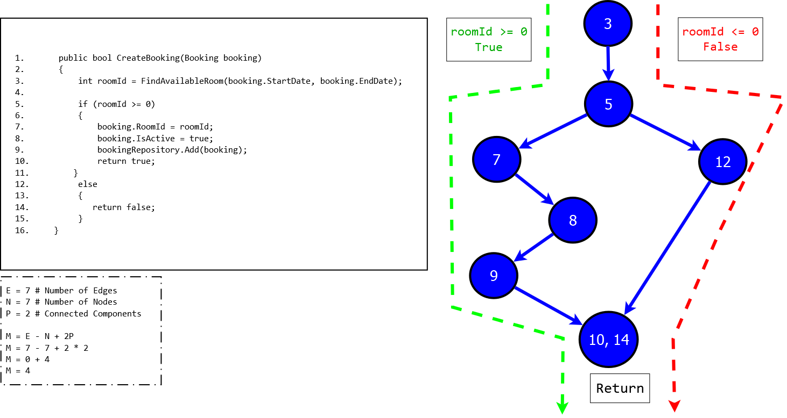
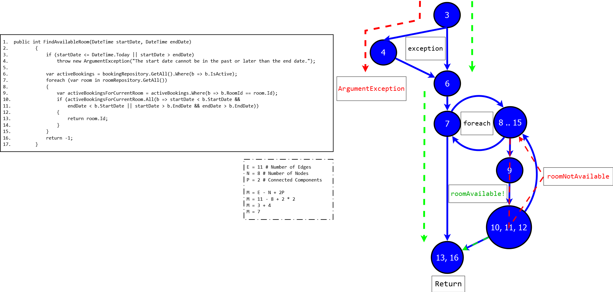

[](https://codecov.io/gh/rafagarciac/DotNETesting)

# .NETesting
HotelBookingRepositoryClean refactored, including Unit Tests, Functional Test using SpecFlow &amp; Gherkin. In addition: Architectural Design it was improved.

## Architectural Design
### Code Structure

---
```bash
└───HotelBooking_Clean                      # Solution Name
    │
    ├───HotelBooking.BusinessLogic          # Business Logic Section
    │   ├───BookingManager.cs
    │   └───IBookingManager.cs
    │
    ├───HotelBooking.Data                   # Mid-Class for Database 
    │   └───Repositories
    │        ├───BookingRepository.cs
    │        ├───CustomerRepository.cs
    │        └───RoomRepository.cs
    │
    ├───HotelBooking.Models                 # Models
    │   ├───Booking.cs
    │   ├───Customer.cs
    │   ├───Room.cs
    │   ├───IRepository.cs                  # Repository Interface 
    │   └───DateManager.cs                  # Class to Dates Manage
    │
    ├───HotelBooking.IntegrationTests       # Database Conn. Test
    │   └───BookingManagerTests.cs
    │
    ├───HotelBooking.UnitTests              # Unit Testing
    │   ├───BookingManagerTest.cs
    │   └───Fakes                          
    │
    ├───HotelBooking.ControllerTests        
    │   ├───BookingControllerTest.cs
    │   ├───CustomerControllerTest.cs
    │   └───RoomControllerTest.cs   
    │    
    ├───HotelBooking.Specs                  # Functional Testing
    │   ├───CreateBooking.feature.cs
    │   ├───FindAvailableRoom.feature.cs 
    │   ├───CreateBookingSteps.cs
    │   ├───FindAvailableRoomSteps.cs 
    │   ├───Fakes 
    │   ├───App.config                      # SpecFlow utilities
    │   └───Properties
    │       └───AssemblyInfo.cs
    │
    ├───HotelBookingStartupProject          # Main Web Project... 
    │   ├───Controllers
    │   ├───Models
    │   ├───Properties
    │   ├───Views
    │   │   ├───Bookings
    │   │   ├───Customers
    │   │   ├───Home
    │   │   ├───Rooms
    │   │   └───Shared
    │   └───wwwroot
    │       ├───css
    │       ├───images
    │       ├───js
    │       └───lib
    │           ├───bootstrap
    │           │   └───dist
    │           │       ├───css
    │           │       ├───fonts
    │           │       └───js
    │           ├───jquery
    │           │   └───dist
    │           ├───jquery-validation
    │           │   └───dist
    │           └───jquery-validation-unobtrusive
    │
    └──────────────── END ─────────────────>
```

## Report
---

Our architecture design consists of several modules dedicated to each part of the project, this is a list of everything with a short description:

### Backend & Logic
***HotelBooking.BusinessLogic***<br>
This is the module in charge of the logical part of the project using the class *"BookingManager.cs"* and the inherate methods *"CreateBooking"* and *"FindAvailableRoom"*.<br><br>
***HotelBooking.Data***<br>
This is the ORM (Object Relational Mapper) of our application.
In addition this module is dedicated to the data that will be treated, previously obtained from a database.<br><br>
***HotelBooking.Models***<br>
The module *"HotelBooking.Models"* is responsible for formatting all the objects that will be developed in the project. We will make a special mention to the class *"DateManager"* of this module, since from this class we assign to all the dates of the tests some dynamic values; this way we make sure that the tests are never obsolete. This technique consists of taking the current date and adding 2 months and 1 day, and 2 months and 8 days, to the start and end dates of the reservations; as if it were fixed parameters.<br><br>

### Testing
***HotelBooking.IntegrationTests***<br>
 The *"HotelBooking.IntegrationTests"* module ensures that the connection to the database is made correctly.<br><br>
***HotelBooking.UnitTests / HotelBooking.ControllerTests***<br>
The *"HotelBooking.UnitTests"* and *"HotelBooking.ControllerTests"* modules ensure that all methods of the *"BookingManager", "BookingController", "CustomerController", "RoomController"* classes are correctly performed.<br><br>
***HotelBooking.Specs***<br>
*"HotelBooking.Specs"* is the module responsible for the functional test of the application. In this part of the project we test that everything is related correctly, interpreters of code are used as Specflow (tool based on Gherkin).<br><br>

### FrontEnd & Web Application 
***HotelBookingStartupProject***<br>
This is the (actual) last module wich consist the Main Web Project with the all statics fields ```(.css,.html,.js...)```<br>

### TDD & Cyclomatic complexity
***
Cyclomatic complexity is a software metric, used to indicate the complexity of a program. It is a quantitative measure of the number of linearly independent paths through a program's source code. It was developed by [Thomas J. McCabe](http://www.literateprogramming.com/mccabe.pdf), Sr. in 1976.

Mathematically, the cyclomatic complexity of a structured program is defined with reference to the control flow graph of the program, a directed graph containing the basic blocks of the program, with an edge between two basic blocks if control may pass from the first to the second. The complexity M is then defined as:

**```M = E − N + 2P```**

where

**E** = the number of edges of the graph. <br>
**N** = the number of nodes of the graph. <br>
**P** = the number of connected components.

### DD-path Graph
- Program graphs 
- Node coverage
- Edge coverage
- Loop coverage

### CreateBooking Graph
***


### FindAvailable Graph
***


### Decision Table
***
| ***Conditions***        | 1<sup>st</sup> Case           | 2<sup>nd</sup> Case  | 3<sup>rd</sup> Case | 4<sup>th</sup> - 5<sup>th</sup> Case | 6<sup>th</sup> - 8<sup>th</sup> Case | 10<sup>th</sup> - 11<sup>th</sup> Case | 12<sup>th</sup> Case |
| ------------- |:-------------:|:-------------:|:-------------:|:-------------:|:-------------:|:-------------:|:-----:|
| ***SD is in***      | B | A | B | B | O | O | P |
| ***ED is in***      | B | A | A | O | O | A | - |
| ***Actions***       |   |   |   |   |   |   |   |
| ***Book Room***     | Y | Y | N | N | N | N | N |
| ***Available Room***| Y | Y | N | N | N | N | N |

|***Legend***|      |
|:-------------: |:-------------:|
|**SD** | StartDate | 
|**SE** | StartDate |
|**B**  | Before    |
|**A**  | After     |
|**O**  | Occupied  |
|**P**  | Past      |

## Technologies Used
- [NUnit](https://github.com/nunit/nunit) - Unit Testing
- [NUnit3TestAdapter]() - In order, to show up the SpecFlow Test in the Test Explorer in VS2017. <br> 
    * **See this topic for more information:** [Tests not discovered in Visual Studio Test Explorer Window](https://github.com/techtalk/SpecFlow/issues/358)
- [xUnit](https://github.com/xunit/xunit) xUnit.net is a free, open source, community-focused unit testing tool for the .NET Framework.
- [Newtonsoft.Json](https://github.com/JamesNK/Newtonsoft.Json) Json.NET is a popular high-performance JSON framework for .NET
- [SpecRun.SpecFlow](https://specflow.org/documentation/NuGet-Integration/) - Installs SpecFlow and SpecRun
- [SpecFlow.Runner](https://specflow.org/plus/runner/) SpecFlow builds on existing unit testing frameworks like NUnit and MsTest.
- [Gherkin](https://docs.cucumber.io/gherkin/reference/) uses a set of special keywords to give structure and meaning to executable specifications.
- [OpenCover](https://github.com/OpenCover/opencover) (Windows only, i.e. Visual Studio 2017)
- [Report Generation Tool](https://github.com/danielpalme/ReportGenerator) ReportGenerator converts XML reports generated by OpenCover, dotCover, Visual Studio, NCover, Cobertura or JaCoCo into human readable reports in various formats.

  
- [AxoCover](https://marketplace.visualstudio.com/items?itemName=axodox1.AxoCover) Nice and free .Net code coverage support for Visual Studio with OpenCover.

## License

[MIT © Rafael García, Miguel Ángel.](./LICENSE)
